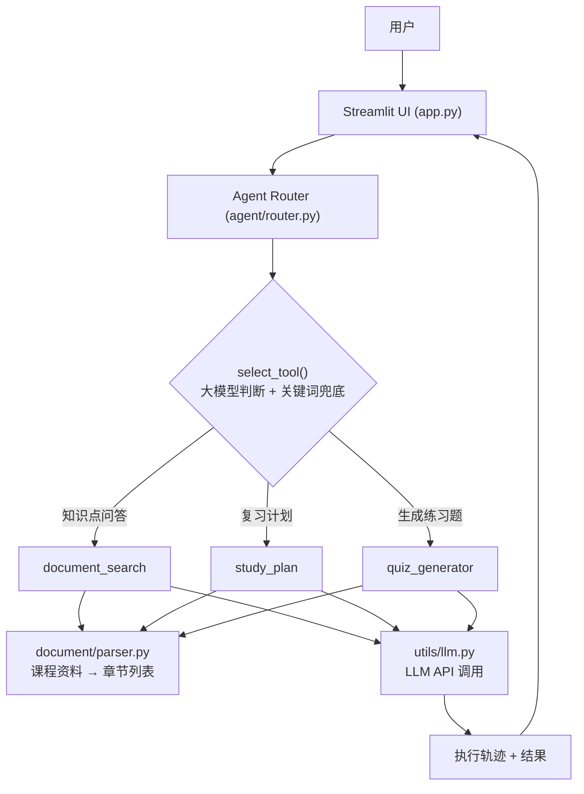

# 课程智航 CoursePilot

基于智能体的自主学习规划与执行系统，让 AI 从理解学习任务、选择工具到生成学习结果形成完整的自主执行流程。

上传一份课程资料，说出你的目标（"帮我安排今晚的复习""帮我出5道题""解释一下XX知识点"），Agent 会自主判断任务类型、选择对应工具、检索课程资料、调用大模型生成结果——**全过程可见、可解释**，而不是一个只会聊天的黑盒 Chatbot。

> 🏆 本项目为高校 AI 智能体竞赛作品（MVP），技术栈刻意保持精简：Python + Streamlit + 单次 HTTP 调用即可对接的 LLM 接口，不依赖数据库、向量库或多智能体框架。

---

## ✨ Features

- 🤖 **真正的 Agent，而非写死的按钮**：Router 用大模型理解自然语言任务，自主判断该调用哪个工具，用户可以用任意措辞描述需求
- 🧭 **任务路由（Task Routing）**：`document_search` / `study_plan` / `quiz_generator` 三选一，大模型判断为主，关键词规则兜底，任何情况下都有确定性输出
- 📚 **课程资料检索**：基于关键词打分（中文 2-gram + 英文分词）在课程资料中定位相关章节，作为大模型的上下文依据，回答"有据可查"
- 📅 **复习计划生成**：基于课程资料的真实章节大纲生成带时间段的复习计划，并给出优先级建议
- 📝 **选择题生成**：基于课程资料自动出题，包含题干、选项、答案与解析，支持指定章节/主题
- 🔍 **Agent 执行轨迹可视化**：UI 实时展示"接收任务 → 分析任务 → 选择 Tool → 检索资料 → 调用大模型 → 完成任务"的真实执行日志，不是预设动画
- 📄 **多格式课程资料支持**：PDF（`pypdf`）、TXT、Markdown，自动按标题切分章节；解析失败会给出明确错误提示
- 🛡️ **稳健降级**：未配置 API Key、网络超时、大模型调用失败时，自动降级为基于原文的确定性方案（原文展示 / 模板计划 / 原文抽取式选择题），保证流程不中断

---

## 🧠 How It Works



核心设计：**Router 负责"决策"，Tool 负责"执行"**。每个 Tool 内部都先做关键词检索定位课程资料中的相关章节，再决定是否调用大模型；没有大模型时依然能产出基于原文的确定性结果，Agent 的检索/决策能力与底层大模型能力解耦。

---

## 🚀 Quick Start

### 1. Clone 项目

```bash
git clone <your-repo-url>
cd coursepilot
```

### 2. 安装依赖

要求 Python 3.9+（开发环境为 Python 3.12）。

```bash
pip install -r requirements.txt
```

### 3. 配置大模型 API（可选，但强烈建议）

```bash
cp .env.example .env
```

编辑 `.env`，填入你的大模型配置：

```
LLM_API_KEY=你的key
LLM_BASE_URL=https://api.openai.com/v1
LLM_MODEL=gpt-4o-mini
```

`LLM_BASE_URL` 兼容任何提供 OpenAI 风格 `/chat/completions` 接口的服务：

| 服务商 | `LLM_BASE_URL` | `LLM_MODEL` 示例 |
|---|---|---|
| OpenAI | `https://api.openai.com/v1` | `gpt-4o-mini` |
| DeepSeek | `https://api.deepseek.com/v1` | `deepseek-chat` |
| Moonshot / Kimi | `https://api.moonshot.cn/v1` | `moonshot-v1-8k` |
| 智谱 GLM-4 | `https://open.bigmodel.cn/api/paas/v4` | `glm-4-flash` |
| 硅基流动 | `https://api.siliconflow.cn/v1` | `Qwen/Qwen2.5-7B-Instruct` |

> **不配置 API Key 也能正常运行。** 所有 Tool 都内置了"简化模式"兜底逻辑（详见 Features），系统会在界面上清晰提示当前使用的是大模型模式还是简化模式，不影响完整流程演示。
>
> ⚠️ `.env` 文件包含你的私钥，已在 `.gitignore` 中排除，切勿手动提交到 Git。

### 4. 启动

```bash
streamlit run app.py
```

浏览器会自动打开 `http://localhost:8501`。

### 5. 运行测试（可选）

```bash
pytest tests -q
```

测试中所有涉及大模型的用例均通过 `monkeypatch` 模拟返回结果，不依赖真实网络请求或 API Key。

---

## 🎬 Demo

启动后点击「📎 使用内置演示资料」加载内置的《计算机网络课程资料》，即可体验以下三个典型场景：

### Demo 1：生成复习计划

```
用户输入：根据这份计算机网络课程资料，帮我制定今晚的考试复习计划，
         并告诉我最应该优先复习哪些内容。
              ↓
Agent 判断任务类型 → 选择 Tool：study_plan
              ↓
检索课程资料的章节大纲 → 调用大模型（或降级为模板）生成计划
              ↓
输出：带具体时间段的复习计划 + 优先复习建议
```

### Demo 2：生成练习题

```
用户输入：根据 TCP/IP 这一章生成5道选择题，并给出答案和解析。
              ↓
Agent 判断任务类型 → 选择 Tool：quiz_generator
              ↓
定位"TCP/IP"相关章节 → 调用大模型生成 JSON 格式题目（或降级为原文抽取式出题）
              ↓
输出：5 道选择题，含题干 / 选项 / 答案 / 解析
```

### Demo 3：知识点问答

```
用户输入：解释 TCP 三次握手，并指出课程资料中最重要的考试知识点。
              ↓
Agent 判断任务类型 → 选择 Tool：document_search
              ↓
关键词检索匹配"TCP 三次握手"相关章节 → 调用大模型基于原文回答
              ↓
输出：基于课程资料的解释 + 参考章节来源
```

三个场景在页面上都可以直接点击对应的快捷示例按钮一键填充，无需手动输入。

---

## 🏗️ Project Structure

```text
coursepilot/
├── app.py                  # Streamlit 主入口（UI + 交互逻辑）
├── agent/
│   ├── router.py             # Agent Router：任务分类 + run_agent 执行主流程
│   └── tools.py               # 三个 Tool 的具体实现
├── document/
│   └── parser.py              # PDF/TXT/Markdown 解析 + 章节切分
├── utils/
│   └── llm.py                  # LLM 调用封装（OpenAI 兼容接口，含容错处理）
├── data/
│   └── demo_course.md         # 内置演示课程资料（计算机网络）
├── tests/
│   └── test_basic.py           # 基础测试（文档解析 / Router / Tool）
├── conftest.py                 # 保证测试能正确导入项目根目录下的模块
├── .env.example                # 环境变量模板（不含真实密钥）
├── .gitignore
├── requirements.txt
├── LICENSE
├── README.md
└── TECHNICAL_DOCUMENT.md       # 技术文档（架构设计 / Agent 工作流程 / 创新点等）
```

---

## 🧩 Tech Stack

- **UI**：[Streamlit](https://streamlit.io/)
- **LLM 调用**：`requests` 直连任意 OpenAI 兼容的 `/chat/completions` 接口
- **文档解析**：[`pypdf`](https://pypi.org/project/pypdf/)（PDF）+ 标准库（TXT/Markdown）
- **配置管理**：[`python-dotenv`](https://pypi.org/project/python-dotenv/)
- **测试**：`pytest` + `monkeypatch`

不引入向量数据库、多智能体框架、容器编排等重型组件——详见 [`TECHNICAL_DOCUMENT.md`](./TECHNICAL_DOCUMENT.md) 中的设计取舍说明。

---

## 📖 更多文档

- [`TECHNICAL_DOCUMENT.md`](./TECHNICAL_DOCUMENT.md)：完整技术文档，包含系统架构、Agent 工作流程、Router/Tool 设计细节、创新点、当前不足与后续展望

## 📄 License

本项目使用 [MIT License](./LICENSE) 开源。
